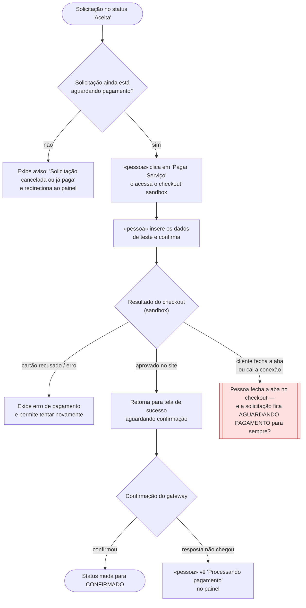

# 🗺️ Jornadas de Usuário

**Projeto:** Faz-Tudo  
**Versão:** 1.0.0 · Versão Inicial aprovada pelo aluno  
**Última atualização:** 2026-09-20

> 🤖 **Este documento é a fonte da verdade sobre O QUE A PESSOA VIVE na tela** —
> o caminho do primeiro clique até o objetivo, e principalmente os pontos onde ela
> trava, espera ou desiste.
>
> 🚫 **Não duplique:** regra de negócio mora no `prd.md`; estado, entidade e contrato
> moram no `architecture.md`. Aqui mora o caminho.

---

## Jornada 1 — US04 (Pagamento e Confirmação de Serviço)

**Story:** US04  
**Critérios que ela marca:** sai do site e volta · depende do tempo · depende de outra pessoa agir · pode ser abandonada no meio

**O que decidimos sobre o nó vermelho (X1):**

A solicitação muda para o status `Aguardando Pagamento` assim que o cliente inicia o checkout, reservando o horário por até 3 horas. Se o cliente fechar a aba, a bateria acabar ou a conexão cair, a solicitação continua nesse estado — o profissional vê o horário como reservado e não pode aceitar outro pedido no mesmo período, evitando conflito de agenda. A confirmação definitiva do pagamento vem sempre do webhook enviado pelo gateway, nunca da tela que o cliente vê no navegador. Se as 3 horas se esgotarem sem a confirmação do webhook, a solicitação expira automaticamente e o horário é liberado novamente para o profissional. Caso o webhook chegue atrasado, mesmo depois da expiração, o pagamento ainda é confirmado — como a cobrança já foi efetuada no lado do cliente, o serviço é considerado válido.

---

## Dúvidas em aberto

| #   | Dúvida                                                                                                                                                          | Onde ela precisa ser resolvida |
| --- | --------------------------------------------------------------------------------------------------------------------------------------------------------------- | ------------------------------ |
| 1   | Mapeamento exato dos estados da solicitação (`Pendente`, `Aceita`, `Em Negociação`, `Aguardando Pagamento`, `Confirmado`, `Expirado`, `Concluído`, `Cancelado`) | `docs/architecture.md`         |
